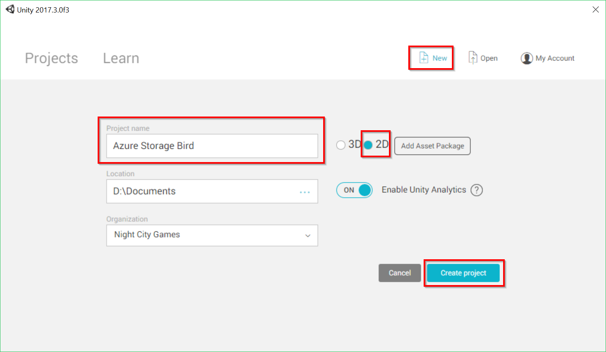

# Azure Storage Bird

## Introduction

This sample game project demonstrates downloading files at runtime from Azure Storage using the Azure Storage SDK for Unity. This is useful for reducing the initial download size of your app. This approach could be adapted for a variety of purposes, such as updating game content without rebuilding and resubmitting the game, or adding new content to a live game.

Because music files typically are among the largest data files in games, the sample game has been designed to leverage several music assets. As the player progresses in the game, the background music changes, providing a good use case for downloading assets at runtime with the Azure Storage SDK.

## Requirements

* [Unity 2017.1 (or greater)](https://unity3d.com/)
  * Unity 2017.1 includes a new scripting runtime that supports .NET 4.6.  This feature allows us to use the existing Azure SDKs with some tweaks.  Please see [this blog post from Unity](https://blogs.unity3d.com/2017/07/11/introducing-unity-2017/) for more information.
* [An Azure subscription (create for free!)](https://aka.ms/azfreegamedev)

## Azure setup

1. [Create an Azure Storage account](https://docs.microsoft.com/en-us/azure/storage/common/storage-quickstart-create-account?tabs=portal).

1. [Create a cointainer](https://docs.microsoft.com/en-us/azure/storage/blobs/storage-quickstart-blobs-portal#create-a-container) called `music`.

1. Download the [sample music files](https://github.com/dantogno/azure-storage-bird/blob/master/Metal%20Mayhem%20Music%20Pack.zip), unzip them, and [upload them to Azure Storage as block blobs](https://docs.microsoft.com/en-us/azure/storage/blobs/storage-quickstart-blobs-portal#upload-a-block-blob). These music files are from the free [Metal Mayhem Music Pack](https://assetstore.unity.com/packages/audio/music/metal-mayhem-music-pack-19233) made available by Unity.

> [!NOTE]
> The sample project is hardcoded to look in a block blob container called `music` and use the specific file names included in the sample music zip file (`Track1.ogg` through `Track10.ogg`). If you use differently named files, or only upload some of the files, you will need to modify the sample project's code accordingly.

## Create a new 2D Unity project

1. Launch Unity and press the **New** button.

1. Select the **2D** radio button.

1. Enter a **Project name** and click **Create project.**

## Set scripting runtime version to .NET 4.6 equivalent

The Azure Storage for Unity SDK requires the .NET 4.6 equivalent scripting runtime. This is only available in Unity 2017+.

1. From the Unity menu select **Edit > Project Settings > Player** to open the **PlayerSettings** panel.

1. Select **Experimental (.NET 4.6 Equivalent)** from the **Scripting Runtime Version** dropdown in the **Configuration** section. Unity will prompt you to restart the editor.

   

## Import the Azure Storage SDK

 You can visit the [SDK documentation](https://docs.microsoft.com/en-us/sandbox/gamedev/unity/azure-storage-unity) to learn more or view other Azure SDKs for Unity.

1. Download the latest Azure Storage SDK [.unitypackage](https://aka.ms/azstorage-unitysdk) from GitHub.

1. From the Unity menu, select **Assets > Import Package > Custom Package**.

1. In the **Import Unity Package** box that pops up, you can select which things you'd like to import. By default everything will be selected. This example project does not use the included AzureSamples, so you can uncheck that box. 

1. Click the **Import** button to add the items to your project.

## Import the sample game assets

The sample game assets depend on the Azure Storage SDK, so be sure to import it first as detailed in the previous steps.

1. Download the sample game assets [.unitypackage](https://aka.ms/azstbird-assets) from GitHub.

1. From the Unity menu, select **Assets > Import Package > Custom Package**.

1. In the **Import Unity Package** box that pops up, keep all of the items checked and click the **Import** button to add them to your project.

## Configure Unity build settings

## 